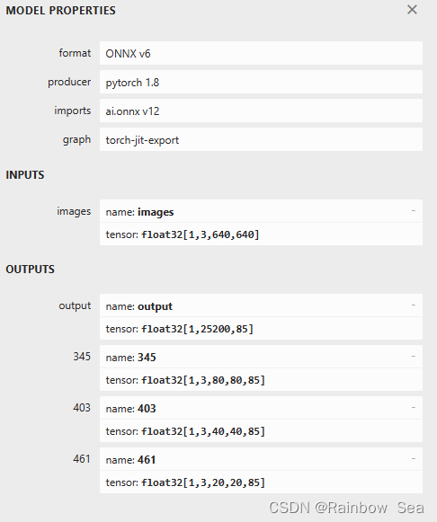
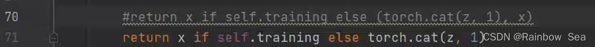

## .pt-> .onnx

```text
git clone git@github.com:ultralytics/yolov5.git
python export.py --weights weights/yolov5s.pt --include onnx
```

## onnx model input output
```text
https://github.com/lutzroeder/netron
```


```text
if output has 4 dimensions , we can modify modules/yolo.py
then output will has only 1-dim
```



## .onnx -> .trt
```text
trtexec --onnx=weights/yolov5s.onnx --saveEngine=yolov5s.trt --fp16
```

## inference
```text
mkdir build
cd build
cmake..
make -j 4
./yolov5_trt ../config.yaml ../samples/
```
